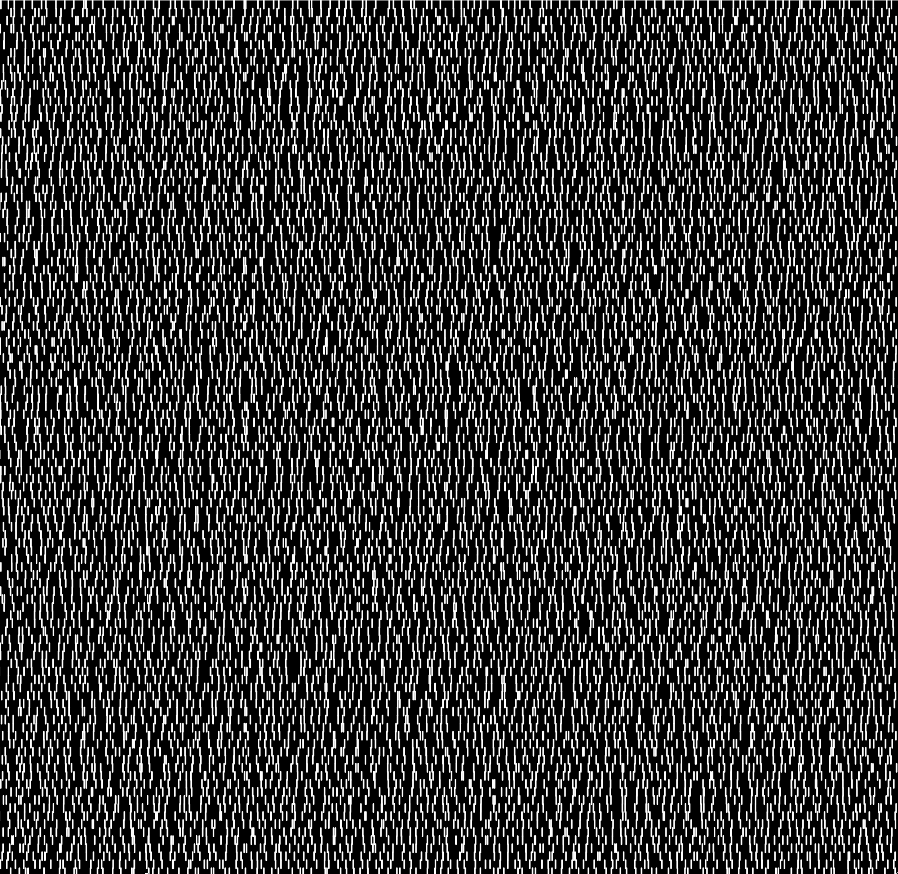
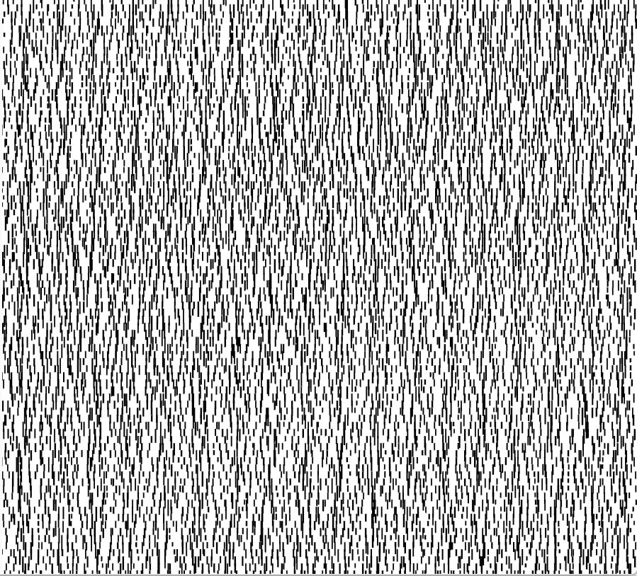
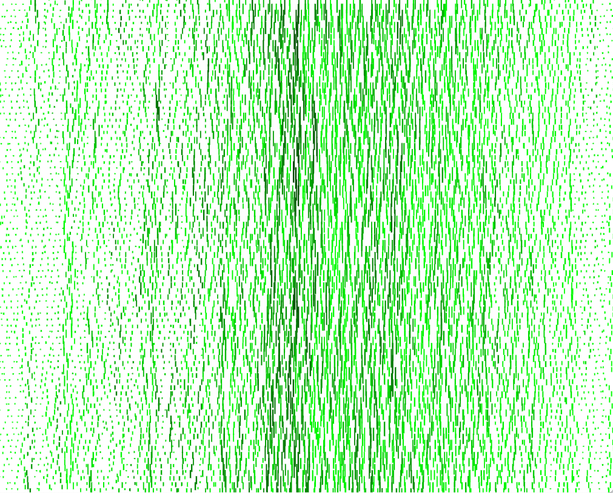
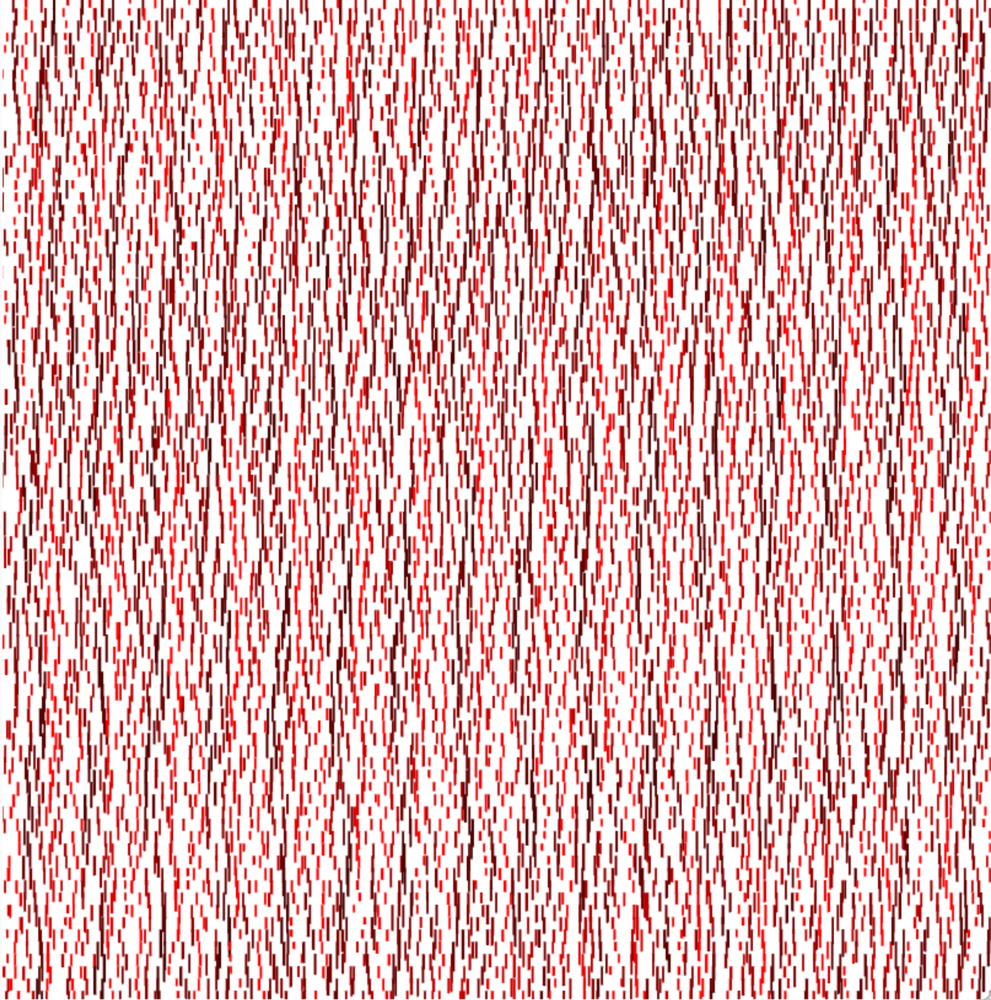
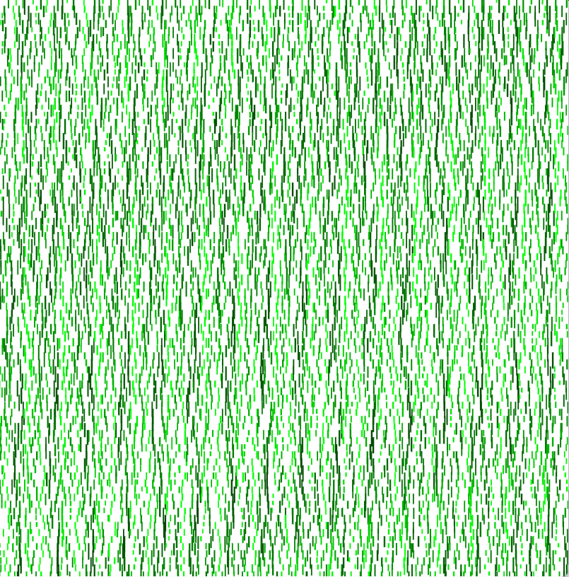

#### Pattern exploration
- initial pattern:  
  
- reverse color for background and foreground  
  
- draw circles along with line and add random offset on the location of circle and line  
  
- add randomness on stroke color  
    

#### Data Pattern exploration (add weather data into pattern making)
- choose the starting pattern  
  
- read temperature data from forecast.json (10 days) and change length of vertical line based on temperature value:  
  
- get humidity data and change stroke color (i.e., red-ish) based on humidity value:  
  
- change stroke color (i.e., green-ish) based on humidity value again   
  
- change data from 10 days to 1 year.   
  
