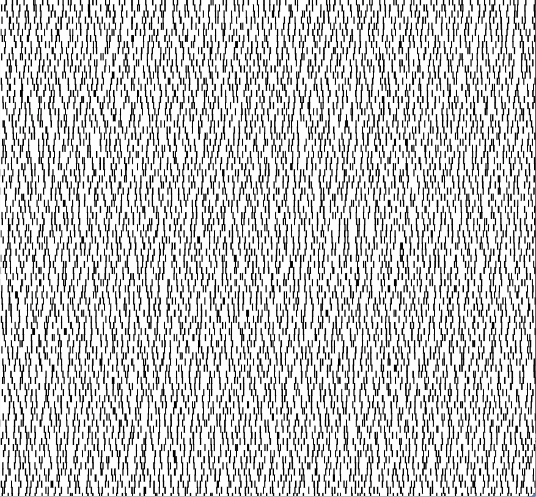
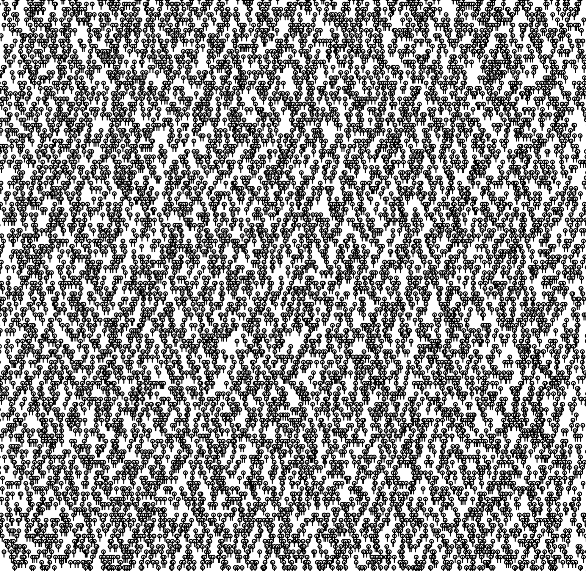

- initial pattern:  
  
- read temperature data from forecast.json (10 days) and change length of vertical line based on temperature value:  
  
- get humidity data and change stroke color based on humidity value:  
  
- change data from 10 days to 1 year.
  
