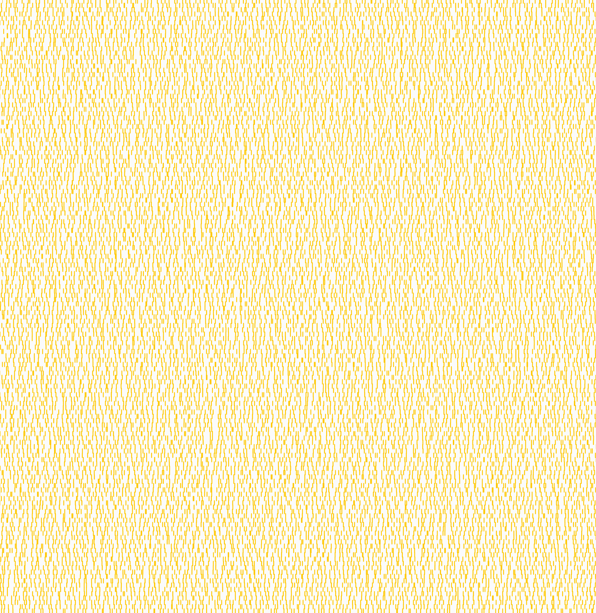
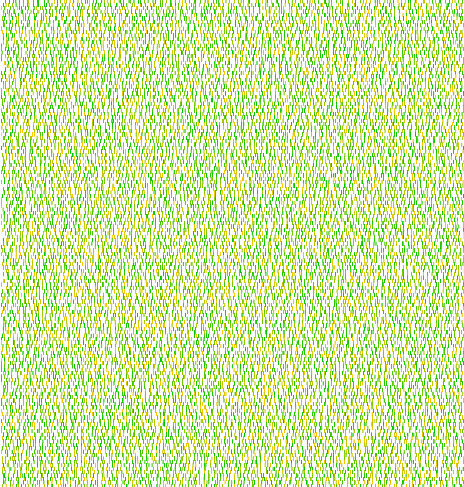
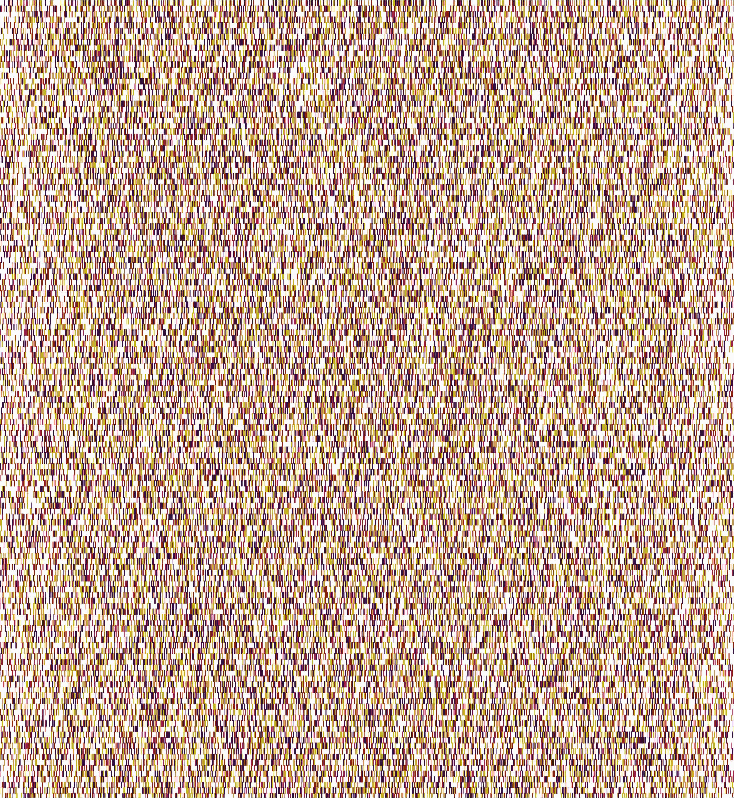
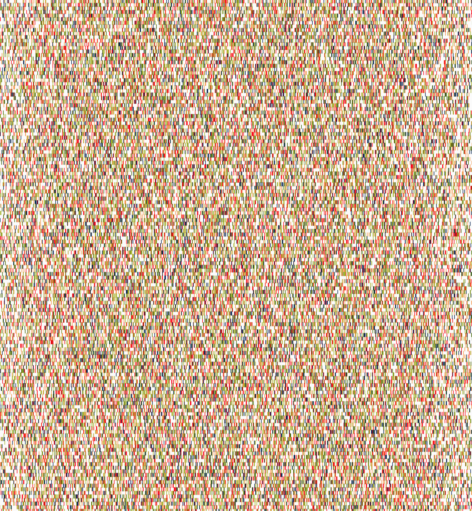
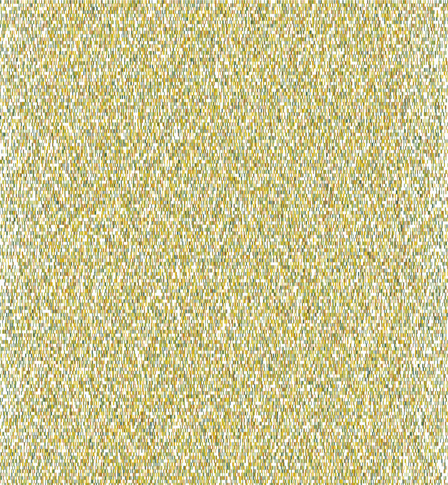

## Exploration history
- use ChatGPT to create a p5.js sketch based on prompt ***"Write p5.js sketch that that draws the following: Vertical lines that are not straight and do not touch each other while covering the wall evenly."***
- fix the color issue for stroke: (255, 200) --> (255, 200, 0)
- add noLoop() into setup to stop p5.js from continuously executing the code within draw()
 

- change line_width and stroke color
-  

- add multiple layers based on an input array: testing data = [5, 200, 30, 200, 40] 
 
 

